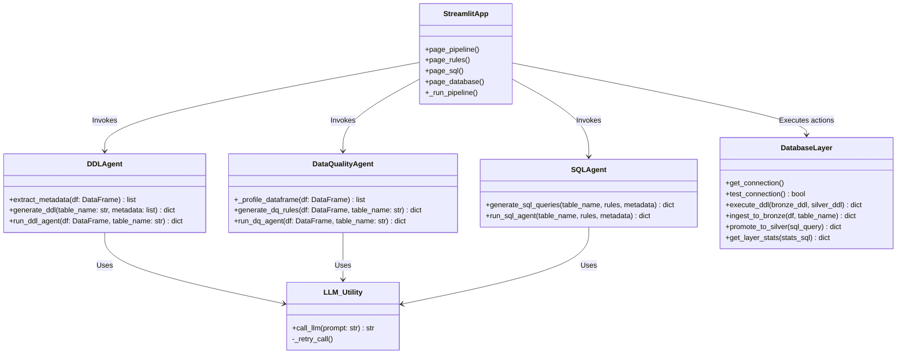

<div align="center">
  <h1>⬡ Agentic Data Pipeline</h1>
  <p><i>An autonomous multi-agent data quality pipeline with a Bronze/Silver architecture</i></p>
</div>

---

## 📖 About the Project

The **Agentic Data Pipeline** is an intelligent, AI-powered system designed to automate the traditionally tedious tasks of data engineering and data quality assurance. 

By leveraging advanced Large Language Models (LLMs) such as Google Gemini or Groq (Llama 3), this application automatically takes raw, unformatted CSV datasets and securely processes them into a structured **PostgreSQL** database using a robust **Bronze-to-Silver** medallion architecture.

Instead of manually writing database schemas, validation rules, and data transformation scripts, this project utilizes **three specialized AI Agents** that collaborate to build the entire pipeline for you in seconds.

---

## 🚀 How It Works

The application operates through a streamlined UI (built with Streamlit) and executes operations in a systematic flow:

### 1. Data Ingestion & Profiling
The user uploads a raw CSV file. The system instantly profiles the data, extracting essential metadata such as column names, data types, null counts, and unique value distributions.

### 2. The Autonomous Agents
Once the user clicks **Run Full Pipeline**, three AI agents are triggered sequentially:
* **🤖 Agent 1 (DDL Generator):** Analyzes the dataset's metadata and writes precise PostgreSQL `CREATE TABLE` scripts for both the raw (Bronze) and clean (Silver) tables.
* **🤖 Agent 2 (Data Quality):** Evaluates the statistical profile of every column and generates strict, logical Data Quality (DQ) rules (e.g., *Age must be > 0*, *Gender must be valid*). It even outputs Python Pydantic validation code.
* **🤖 Agent 3 (SQL Builder):** Takes the DQ rules and writes complex PostgreSQL `INSERT INTO ... SELECT` queries that filter out bad records while moving data from Bronze to Silver.

### 3. Database Execution
* **Create Tables:** Executes the generated DDL in PostgreSQL.
* **Ingest to Bronze:** Performs a rapid bulk-insert of the raw CSV data into the `bronze` schema without any modifications.
* **Promote to Silver:** Executes the generated SQL to enforce the DQ rules. Clean, validated records are securely inserted into the `silver` schema, while failed records are flagged.

---

## 🏗️ System Architecture & Class Diagram

The project is structured with a clear separation of concerns between the user interface, the AI agents, and the database integration layer.



---

## ⚙️ Setup & Installation

### 1. Clone & Install Dependencies
Ensure you have Python 3.10+ installed, then create a virtual environment and install the requirements:
```powershell
python -m venv .venv
.\.venv\Scripts\activate
pip install -r requirements.txt
```

### 2. Configure Environment Variables
Create a `.env` file in the root directory (or copy `.env.example`). You must provide your database credentials and an AI API key (Gemini, Groq, NVIDIA NIM, etc.):

| Variable | Default | Description |
|---|---|---|
| `LLM_PROVIDER` | `groq` | Choose from `gemini`, `groq`, `nim`, `openai` |
| `GROQ_API_KEY` | — | Your Groq API Key (if using Groq) |
| `GEMINI_API_KEY` | — | Your Google Gemini API key (if using Gemini) |
| `POSTGRES_HOST` | localhost | PostgreSQL host |
| `POSTGRES_PORT` | 5432 | PostgreSQL port |
| `POSTGRES_USER` | postgres | DB username |
| `POSTGRES_PASSWORD` | postgres | DB password |
| `POSTGRES_DB` | dq_pipeline | Database name |

### 3. Run the Application
Ensure your PostgreSQL database is running, then start the Streamlit UI:
```powershell
# Activate the environment (if not already active)
.\.venv\Scripts\activate

# Run the app
streamlit run app.py
```
The application will be instantly available in your browser at `http://localhost:8501`.

---

## 📂 Project Structure

```text
dq_pipeline/
├── app.py                  ← Streamlit User Interface
├── agents/
│   ├── ddl_agent.py        ← DDL Generator (schema extraction + table creation)
│   ├── dq_agent.py         ← Data Quality agent (Pydantic rule generation)
│   └── sql_agent.py        ← SQL Query agent (Bronze→Silver migration logic)
├── database/
│   └── db.py               ← PostgreSQL engine (psycopg2 + SQLAlchemy)
├── utils/
│   └── llm.py              ← API connectivity for LLMs (Groq, Gemini, NIM, OpenAI)
├── requirements.txt        ← Python dependencies
├── .env                    ← Environment configuration
└── README.md               ← Project Documentation
```

# loking into the bronze table

# SELECT * FROM bronze."teen_mental_health_dataset_-_copy_bronze" 
# LIMIT 5;

# loking for the solver table
# SELECT * FROM silver."teen_mental_health_dataset_-_copy_silver" 
# LIMIT 5;